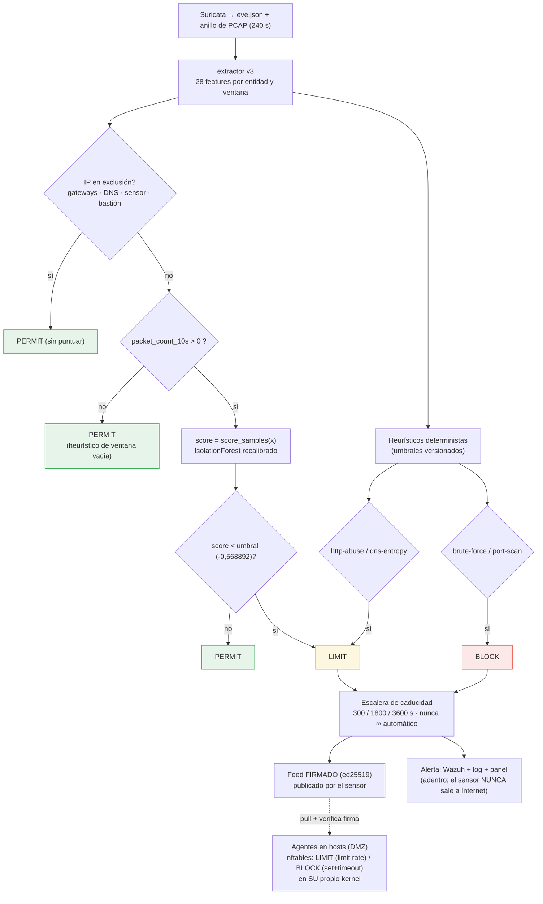

# Flujo de decisión (alineado a v1.0.0)

Este diagrama sustituye al boceto previo ("IF.decision_function, 14 features,
Telegram, DROP en el kernel del sensor"), que ya **no** refleja el sistema real.
Diferencias corregidas: **28 features**, IsolationForest **recalibrado**, el motor usa
**`score_samples`** con umbral **-0,568892**, LIMIT/BLOCK los decide la combinación
modelo + **heurísticos**, la acción se aplica **en el host** (no en el sensor, que
observa por espejo), y la alerta va a **Wazuh** (nunca egress externo).

## Notas de lectura
- **El sensor observa por espejo SPAN**: no está en el camino, así que la acción
  (LIMIT/BLOCK) la aplican los **agentes en los hosts**, no el sensor. Ver
  `DISENO-ENFORCEMENT.md`.
- **Modelo vs heurísticos**: el modelo (score) marca la anomalía → **LIMIT**; los
  heurísticos confirmados (fuerza bruta, escaneo) → **BLOCK**. Los heurísticos cubren
  los huecos del modelo (validado: 0,08 % de falsos positivos en tráfico normal).
- **Estado actual (v1.0.0)**: implementado hasta `PERMIT/ALERT` (observación,
  calibrado). El bloque LIMIT/BLOCK + feed + agentes es **v1.1** (rama
  `v1.1-enforcement`): el "cerebro" (heurísticos + feed + escalera) ya está y probado;
  falta integrarlo en el motor y los agentes de host (tras la validación).
