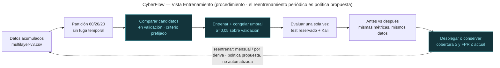

# Vistas de CyberFlow — en Mermaid

Las tres vistas de topología del panel (`dashboard.py`, `TOPO_VISTAS`), en Mermaid
editable, **corregidas el 2026-10-09** tras la revisión de la documentación:

- `01-operacional.mmd` — **Operacional**: cómo funciona en vivo (el camino del paquete).
- `02-metodologica.mmd` — **Metodológica**: cómo se construyó (las 7 fases del método).
- `03-entrenamiento.mmd` — **Entrenamiento**: el procedimiento datos → selección →
  entrenamiento → evaluación → decisión.

Cada `.mmd` tiene su `.png` renderizado al lado. Este README se genera a partir de los
`.mmd`: si se cambia un diagrama, se regenera. Convención de color: hosts en azul,
**artefactos** como cilindros con borde punteado, **sumidero** en rojo y acento teal para
modelo, decisión y respuesta.

## Precisiones (no son decoración)

- **Selección del modelo.** Los candidatos se comparan **en validación** con un criterio
  **fijado antes** de mirar el test; el **test se reserva** para una sola evaluación final.
  La comparación histórica de siete candidatos del laboratorio promovió el OCSVM **después**
  de ver el test (sesgo declarado): el diagrama describe el procedimiento correcto, no aquel.
- **Reentrenamiento mensual o por deriva = política propuesta.** No hay automatización
  comprobada del reentrenamiento: lo automatizado es la **acumulación** de la línea base
  (`cyberflow-acumular.timer`). El ciclo se ejecuta a mano, en seco, con el runbook, y solo
  se despliega si mejora o iguala la cobertura sin empeorar el FPR.
- **Variables.** El extractor v3 emite 31; el modelo consume **28** (contrato v2).

---

## 1 · Operacional (cómo funciona en vivo)

```mermaid
---
title: CyberFlow — Vista Operacional (cómo funciona en vivo · el camino del paquete)
---
flowchart LR
  subgraph G0["Hosts · VLAN 20/30"]
    direction TB
    atacante(["Atacante (Kali)<br/>10.10.20.30 · lanza los ataques"])
    clientes(["Clientes<br/>10.10.20.21-.26 · 6 perfiles legítimos"])
    servidor(["Servidor<br/>10.10.30.10 · objetivo HTTP/HTTPS"])
    gateway(["pfSense / gateway<br/>10.10.20.1 · enruta entre VLAN"])
  end
  subgraph G1["1 · Adquisición"]
    direction TB
    red["Red de la entidad<br/>VLAN 10-100"]
    span["Espejo SPAN<br/>CORE-STACK"]
    nic["Interfaz en escucha<br/>ens37 · SIN IP"]
    captura["tcpdump<br/>SERVICIO"]
    pcap[("anillo live-*.pcap<br/>ARTEFACTO")]
    suricata["Suricata<br/>SERVICIO"]
    eve[("eve.json<br/>ARTEFACTO")]
  end
  subgraph G2["2 · Análisis"]
    direction TB
    motor["Atribución de flujo<br/>SERVICIO"]
    variables["Variables / 10 s<br/>L2·L3·L4·L7"]
    descartes["Fuera del cálculo<br/>SUMIDERO"]
    reentrenamiento["Reentrenamiento<br/>POLÍTICA PROPUESTA · manual"]
    modelo["Modelo recalibrado<br/>IF · CALIBRADO"]
    heuristicos["Heurísticos<br/>DETERMINISTAS"]
  end
  subgraph G3["3 · Decisión y respuesta"]
    direction TB
    control["Decisión<br/>PERMIT / LIMIT / BLOCK"]
    feed[("Feed firmado<br/>ed25519")]
    agente["Agente en host<br/>nftables LIMIT/BLOCK"]
  end
  subgraph G4["4 · Observabilidad"]
    direction TB
    registro[("motor_decision.log<br/>ARTEFACTO")]
    panel["Este panel<br/>SOLO LECTURA"]
    wazuh["Wazuh (SIEM)<br/>CONCENTRADOR"]
  end

  atacante -->|ataca| red
  clientes -->|tráfico| red
  servidor -->|objetivo| red
  gateway -->|enruta| red
  red -->|al troncal| span
  span -->|copia| nic
  nic -->|paquetes| captura
  nic -->|paquetes| suricata
  captura --> pcap
  suricata --> eve
  pcap -->|"L3·L4"| motor
  eve -->|"HTTP·DNS·TLS"| motor
  motor -->|atribuye por IP| variables
  motor -. descarta .-> descartes
  variables -->|"28 al modelo (31 extraídas)"| modelo
  variables -->|mismas variables| heuristicos
  reentrenamiento -->|entrena y congela| modelo
  modelo -->|"score &lt; umbral"| control
  heuristicos -->|confirmado| control
  control -->|veredicto firmado| feed
  feed -->|pull + verifica| agente
  control -->|cada decisión| registro
  registro -->|lee| panel
  registro -->|syslog| wazuh

  classDef host fill:#1b2b3a,stroke:#3a5169,color:#dce8f5;
  classDef arte fill:#15202c,stroke:#2b3a4a,color:#9fd0ff,stroke-dasharray:4 3;
  classDef sink fill:#2a1a1a,stroke:#6a3030,color:#f0c0c0;
  classDef accent fill:#13343b,stroke:#2a7f8a,color:#8fe0ea;
  class atacante,clientes,servidor,gateway host;
  class pcap,eve,registro,feed arte;
  class descartes sink;
  class modelo,control accent;
```

---

## 2 · Metodológica (cómo se construyó · 7 fases)

---

## 3 · Entrenamiento (procedimiento)

