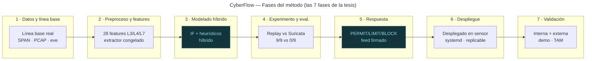

# Vistas de CyberFlow — en Mermaid

Las vistas de topología del panel (`dashboard.py`, `TOPO_VISTAS`), en Mermaid editable,
**actualizadas el 2026-10-10** para separar construcción y operación:

- `01-operacional.mmd` — **Operacional**: del espejo salen **dos fuentes** de la misma
  copia — el PCAP crudo (tcpdump) y eve.json (Suricata) — cada una con **su parser**
  (paquetes y eventos), que juntas arman las variables por IP y ventana; modelo +
  heurísticos deciden PERMIT o ALERT, y la ALERT se traduce en LIMIT o BLOCK.
- `02-metodologica.mmd` — **Fases del método**: las 7 fases de la tesis.
- `03-construccion-entrenamiento.mmd` — **Construcción y entrenamiento**: datos →
  limpieza → partición → candidatos → métricas → selección → congelación → despliegue →
  acumulación → reentrenamiento → antes/después, con las cifras del informe de calibración.

Cada `.mmd` tiene su `.png` al lado. Este README se genera desde los `.mmd` y, la matriz,
desde el código del producto (`scripts/engine/vista_vivo.py`): si cambia uno, se regenera.

En el panel (rama `as-deployed-sensor-20261006`, modo desarrollador) la sección
**«Datos en vivo»** muestra, sobre un tramo reciente y con la misma cadena del motor:
**A** los eventos de eve.json y **B** las tramas del PCAP, cada registro con la variable
que actualiza, su aporte, su ventana y el valor real de la fila de `build_rows`; por
omisión solo los registros que aportan. La tercera pestaña es la matriz de abajo.

## Precisiones (no son decoración)

- **Dos fuentes, no «eve.json por la NIC».** Suricata deriva eve.json de las mismas tramas
  que tcpdump guarda; el motor las lee por separado y las une por IP y ventana.
- **Selección del modelo.** En el laboratorio se compararon 7 candidatos y el OCSVM se
  promovió **después** de ver el test (sesgo declarado). En esta red se reentrenó un solo
  candidato, el IF, porque el OCSVM no transfirió (92,4 % de FPR con el umbral de otra red);
  el umbral del IF se fijó en validación (α = 0,05) antes de mirar el test (4,45 %).
- **«92,4 % → 4,45 %» no es un reentrenamiento del mismo modelo**: es cambio de modelo y
  de umbral. La comparación antes/después de un reentrenamiento con datos reservados
  nuevos sigue pendiente (bloque B3).
- **Reentrenamiento mensual o por deriva = política propuesta.** Lo automatizado es la
  **acumulación** de la línea base; el ciclo se ejecuta a mano, en seco, y solo se promueve
  si el FPR no empeora y la detección no baja.
- **Variables.** El extractor v3 emite 31; el modelo consume **28** (contrato v2).

---

## 1 · Operacional (dos fuentes, dos parsers)

```mermaid
---
title: CyberFlow — Vista Operacional (dos fuentes, dos parsers, una decisión por IP y ventana)
---
flowchart LR
  subgraph G0["Hosts · VLAN 20/30"]
    direction TB
    atacante(["Atacante (Kali)<br/>10.10.20.30 · lanza los ataques"])
    clientes(["Clientes<br/>10.10.20.21-.26 · 6 perfiles legítimos"])
    servidor(["Servidor<br/>10.10.30.10 · objetivo HTTP/HTTPS"])
    gateway(["pfSense / gateway<br/>10.10.20.1 · enruta entre VLAN"])
  end
  subgraph G1["1 · Adquisición (una copia, dos fuentes)"]
    direction TB
    red["Red de la entidad<br/>VLAN 10-100"]
    span["Espejo SPAN<br/>CORE-STACK"]
    nic["Interfaz en escucha<br/>ens37 · SIN IP"]
    captura["tcpdump<br/>captura cruda"]
    pcap[("anillo live-*.pcap<br/>FUENTE CRUDA")]
    suricata["Suricata<br/>parseo de protocolos"]
    eve[("eve.json<br/>FUENTE ESTRUCTURADA")]
  end
  subgraph G2["2 · Análisis"]
    direction TB
    motor["Parser de paquetes<br/>trama → flujo · L2·L3·L4"]
    parser_eve["Parser de eventos<br/>JSON → L7 · http·dns·tls"]
    variables["Variables / 10 s<br/>por IP y ventana 10/30/60 s"]
    descartes["Fuera del cálculo<br/>control · espejo · excluidas"]
    reentrenamiento["Reentrenamiento<br/>POLÍTICA PROPUESTA · manual"]
    modelo["Modelo recalibrado<br/>IF · umbral −0,568892"]
    heuristicos["Heurísticos<br/>4 reglas · 2026-10-06.2"]
  end
  subgraph G3["3 · Decisión y respuesta"]
    direction TB
    control["Decisión<br/>PERMIT · ALERT → LIMIT/BLOCK"]
    feed[("Feed firmado<br/>ed25519")]
    agente["Agente en host<br/>nftables LIMIT/BLOCK"]
  end
  subgraph G4["4 · Observabilidad"]
    direction TB
    registro[("motor_decision.log<br/>ARTEFACTO")]
    panel["Panel · Datos en vivo<br/>SOLO LECTURA"]
    wazuh["Wazuh (SIEM)<br/>CONCENTRADOR"]
  end

  atacante -->|ataca| red
  clientes -->|tráfico| red
  servidor -->|objetivo| red
  gateway -->|enruta| red
  red -->|al troncal| span
  span -->|copia| nic
  nic -->|tramas| captura
  nic -->|tramas| suricata
  captura --> pcap
  suricata --> eve
  pcap -->|tramas| motor
  eve -->|eventos| parser_eve
  motor -->|"L2·L3·L4 por IP"| variables
  parser_eve -->|"L7 por IP"| variables
  motor -. descarta .-> descartes
  variables -->|"28 al modelo (31 extraídas)"| modelo
  variables -->|"variables + conteos"| heuristicos
  reentrenamiento -->|entrena y congela| modelo
  modelo -->|"score &lt; umbral → ALERT"| control
  heuristicos -->|"regla cumplida → ALERT"| control
  control -->|veredicto firmado| feed
  feed -->|pull + verifica| agente
  control -->|cada decisión| registro
  registro -->|lee| panel
  pcap -. "tramo reciente" .-> panel
  eve -. "tramo reciente" .-> panel
  registro -->|syslog| wazuh

  classDef host fill:#1b2b3a,stroke:#3a5169,color:#dce8f5;
  classDef arte fill:#15202c,stroke:#2b3a4a,color:#9fd0ff,stroke-dasharray:4 3;
  classDef sink fill:#2a1a1a,stroke:#6a3030,color:#f0c0c0;
  classDef accent fill:#13343b,stroke:#2a7f8a,color:#8fe0ea;
  class atacante,clientes,servidor,gateway host;
  class pcap,eve,registro,feed arte;
  class descartes sink;
  class motor,parser_eve,modelo,control accent;
```

---

## 2 · Construcción y entrenamiento

```mermaid
---
title: CyberFlow — Construcción y entrenamiento (de los datos al modelo congelado y su ciclo de vida)
---
flowchart LR
  subgraph C1["1 · Construcción (una vez, en seco)"]
    direction LR
    c_datos["Datos de la red<br/>SPAN → PCAP + eve.json<br/>335 202 ventanas normales"]
    c_limpia["Limpieza y alcance<br/>sin plano de control, sin copias<br/>del espejo · sin imputación"]
    c_part["Partición sin fuga temporal<br/>204 148 / 65 633 / 65 421<br/>bloques horarios + guarda 60 s"]
    c_cand["Candidatos<br/>7 en laboratorio (IF×4, LOF,<br/>OCSVM, EE) · IF en esta red"]
    c_metr["Comparar métricas<br/>FPR val/test · detección Kali<br/>F1 · MCC · AUC (laboratorio)"]
    c_sel["Selección<br/>IF recalibrado: transfiere<br/>a esta red (OCSVM no)"]
    c_datos --> c_limpia --> c_part --> c_cand --> c_metr --> c_sel
  end
  subgraph C2["2 · Operación y ciclo"]
    direction LR
    c_cong["Congelar modelo + umbral<br/>α = 0,05 en validación<br/>score_samples < −0,568892"]
    c_desp["Despliegue<br/>promover + verificar<br/>hash · orden · equivalencia"]
    c_acum["Acumulación<br/>temporizador · filas v3<br/>(única parte automática)"]
    c_reent["Reentrenar / recalibrar<br/>mensual o por deriva<br/>POLÍTICA PROPUESTA"]
    c_antes["Antes vs después<br/>mismos datos y métricas<br/>ref.: FPR 92,4 % → 4,45 %"]
    c_cong --> c_desp --> c_acum --> c_reent --> c_antes
  end
  c_sel -->|"umbral desde validación"| c_cong
  c_reent -. "repite 3→6 con datos nuevos" .-> c_part
  c_antes -. "FPR ≤ y detección ≥ → se congela el nuevo; si no, se queda el vigente" .-> c_cong

  classDef accent fill:#13343b,stroke:#2a7f8a,color:#8fe0ea;
  classDef prop fill:#2b2410,stroke:#7a6420,color:#f0d890;
  class c_part,c_sel,c_cong accent;
  class c_reent prop;
```

---

## 3 · Fases del método (7 fases)

---

## 4 · Matriz de trazabilidad (fuente → registro → parser → variable → ventana → uso)

Generada de `configs/features/multilayer-v{2,3}.json`, de `build_rows` y de `heuristicos.py`. «modelo» = entra al Isolation Forest; «conteo» = solo lo leen los heurísticos; «capa 2» = se acumula y no se puntúa.

| Fuente | Registro que la alimenta | Parser | Variable | Capa | Ventana | Uso | Heurísticos |
|---|---|---|---|---|---:|---|---|
| PCAP (SPAN) | toda trama IPv4 atribuida a la entidad | `parse_con_contexto → attribute_packets` | `packet_rate_10s` | L3 | 10 s | modelo | — |
| PCAP (SPAN) | toda trama IPv4 atribuida (bytes IP) | `parse_con_contexto → attribute_packets` | `byte_rate_10s` | L3 | 10 s | modelo | — |
| PCAP (SPAN) | toda trama IPv4 atribuida (longitud IP) | `parse_con_contexto → attribute_packets` | `mean_ip_len_10s` | L3 | 10 s | modelo | — |
| PCAP (SPAN) | trama de 500 a 1500 bytes IP | `parse_con_contexto → attribute_packets` | `large_ip_ratio_10s` | L3 | 10 s | modelo | — |
| PCAP (SPAN) | primer paquete de un flujo (destino) | `parse_con_contexto → attribute_packets` | `unique_dst_ip_ratio_30s` | L3 | 30 s | modelo | — |
| PCAP (SPAN) | paquete ICMP | `parse_con_contexto → attribute_packets` | `icmp_ratio_10s` | L3 | 10 s | modelo | — |
| PCAP (SPAN) | primer paquete de un flujo | `parse_con_contexto → attribute_packets` | `flow_attempt_rate_10s` | L4 | 10 s | modelo | — |
| PCAP (SPAN) | TCP SYN sin ACK enviado por la entidad | `parse_con_contexto → attribute_packets` | `syn_rate_10s` | L4 | 10 s | modelo | — |
| PCAP (SPAN) | SYN enviado (denominador) y SYN-ACK recibido (numerador) | `parse_con_contexto → attribute_packets` | `syn_completion_ratio_10s` | L4 | 10 s | modelo | `port_scan` |
| PCAP (SPAN) | segmento TCP con RST, sobre todos los TCP | `parse_con_contexto → attribute_packets` | `rst_ratio_10s` | L4 | 10 s | modelo | — |
| PCAP (SPAN) | primer paquete de un flujo con puerto destino | `parse_con_contexto → attribute_packets` | `unique_dst_port_ratio_30s` | L4 | 30 s | modelo | `port_scan` |
| eve.json | evento http con estado >= 400 | `load_app_observations` | `http_error_ratio_60s` | L7 | 60 s | modelo | — |
| eve.json | respuesta dns NXDOMAIN, sobre las consultas | `load_app_observations` | `dns_nxdomain_ratio_60s` | L7 | 60 s | modelo | `dns_entropy` |
| eve.json | evento tls (sesiones distintas por flow_id) | `load_app_observations` | `tls_session_rate_60s` | L7 | 60 s | modelo | — |
| PCAP (SPAN) | toda trama IPv4 atribuida (TTL) | `parse_con_contexto → attribute_packets` | `ttl_mean_10s` | L3 | 10 s | modelo | — |
| PCAP (SPAN) | paquete IP fragmentado | `parse_con_contexto → attribute_packets` | `fragment_ratio_10s` | L3 | 10 s | modelo | — |
| PCAP (SPAN) | toda trama IPv4 atribuida (protocolo) | `parse_con_contexto → attribute_packets` | `protocol_diversity_30s` | L3 | 30 s | modelo | — |
| PCAP (SPAN) | segmento TCP con datos cuya secuencia ya se vio | `parse_con_contexto → attribute_packets` | `tcp_retransmission_ratio_10s` | L4 | 10 s | modelo | — |
| PCAP (SPAN) | cualquier paquete de un flujo (duración acumulada) | `parse_con_contexto → attribute_packets` | `flow_duration_mean_30s` | L4 | 30 s | modelo | — |
| PCAP (SPAN) | trama atribuida, según sentido (enviada o recibida) | `parse_con_contexto → attribute_packets` | `tx_rx_byte_ratio_30s` | L4 | 30 s | modelo | — |
| eve.json | evento http | `load_app_observations` | `http_request_rate_60s` | L7 | 60 s | modelo | — |
| eve.json | evento http (método) | `load_app_observations` | `http_method_entropy_60s` | L7 | 60 s | modelo | — |
| eve.json | evento http con estado 401 o 403 | `load_app_observations` | `http_auth_failure_ratio_60s` | L7 | 60 s | modelo | `brute_force`, `http_abuse` |
| eve.json | evento dns de consulta | `load_app_observations` | `dns_query_rate_60s` | L7 | 60 s | modelo | — |
| eve.json | evento dns de consulta (nombre) | `load_app_observations` | `unique_dns_name_ratio_60s` | L7 | 60 s | modelo | `dns_entropy` |
| eve.json | evento tls sin versión negociada (en la práctica no ocurre) | `load_app_observations` | `tls_handshake_failure_ratio_60s` | L7 | 60 s | modelo | — |
| eve.json | evento tls con versión (proporción de TLS 1.3) | `load_app_observations` | `tls_version_ratio_60s` | L7 | 60 s | modelo | — |
| eve.json | evento http con estado 5xx | `load_app_observations` | `http_status_5xx_ratio_60s` | L7 | 60 s | modelo | — |
| PCAP (SPAN) | trama ARP de petición | `l2_en_alcance` | `arp_request_rate_10s` | L2 | 10 s | solo extractor v3 (capa 2, fuera del scoring) | — |
| PCAP (SPAN) | trama de la entidad (MAC de origen) | `l2_en_alcance` | `unique_src_mac_30s` | L2 | 30 s | solo extractor v3 (capa 2, fuera del scoring) | — |
| PCAP (SPAN) | trama de la entidad (cambio de MAC para su IP) | `l2_en_alcance` | `mac_ip_binding_changes_60s` | L2 | 60 s | solo extractor v3 (capa 2, fuera del scoring) | — |
| PCAP (SPAN) | primer paquete de un flujo | `parse_con_contexto → attribute_packets` | `flow_attempt_count_30s` | L4 | 30 s | conteo (no va al modelo) | `port_scan` |
| eve.json | evento http | `load_app_observations` | `http_request_count_60s` | L7 | 60 s | conteo (no va al modelo) | `brute_force`, `http_abuse` |
| eve.json | evento dns de consulta | `load_app_observations` | `dns_query_count_60s` | L7 | 60 s | conteo (no va al modelo) | `dns_entropy` |
