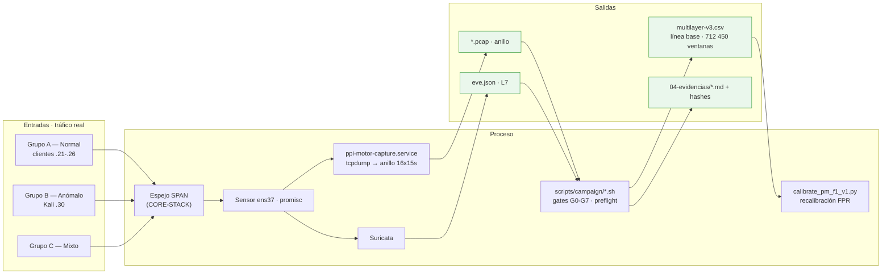

# F1 · Datos y línea base

**Objetivo.** Construir el dataset a partir de **tráfico real** observado por
espejo SPAN (no sintético) y **recalibrar** el comportamiento del sistema en la
red de operación. A diferencia de los artículos semilla, que descargan un dataset
ya hecho, aquí los datos nacen de la propia red y pasan por *gates* de calidad
antes de darse por buenos.

## Diagrama



## Flujo

El tráfico de los tres grupos cruza el **troncal espejado (SPAN)**. El **sensor**
lo recibe en `ens37` en modo promiscuo —interfaz por MAC, no por nombre— y lo
entrega a dos consumidores: el **anillo de PCAP** (`ppi-motor-capture.service`,
16×15 s = 240 s de historia) y **Suricata**, que emite señales L7 en `eve.json`.

Nada se corre a mano: el **orquestador de campañas** aplica preflight y *gates*
(G0 línea base, G2 calibración de carga, G3 orquestador, G4 captura PCAP, G5
contrato de variables, G7 aislamiento/NTP). Los **techos de carga están en el
código** (`run-benign.sh` aborta fuera de su lista blanca: TCP ≤ 200 Mbit/s,
etc.) y hay un presupuesto conjunto de bytes. **Nada se borra**: los intentos
rechazados se archivan con sus hashes.

El dataset de línea base se acumula en `multilayer-v3.csv` (el anillo en disco
solo retiene ~15 min —`retener_minutos`—, así que `cyberflow-acumular.timer`
extrae y **añade filas**). Finalmente se **recalibra**
contra tráfico propio: es lo que baja el FPR de 92,4 % a 4,45 % y separa una
demostración de una medición.

## Cómo se ejecuta

```bash
# Aprovisionamiento del testbed (orden estricto)
ansible-playbook ansible/playbooks/00-validar-controlador.yml
#                 01-comprobar-conectividad · 02-auditar-recursos
#                 03-configurar-servicios-servidor · 04-configurar-cliente-f1
#                 05-ajustar-captura-suricata
# Campaña (orquestada, con gates)
scripts/campaign/start.sh   &&   scripts/campaign/run-f1.sh      # tráfico benigno
scripts/campaign/run-f1-kali.sh                                  # tráfico anómalo
```

## Cifras / evidencia clave

- **FPR recalibrado:** 92,4 % → **4,45 %** (respuesta al *distribution shift*
  sim→real). Heurísticos ~0,01 % sobre **712 450 ventanas**.
- **Línea base:** `multilayer-v3.csv` acumulado por `cyberflow-acumular.timer`
  (PCAP de 72 h = ~280 GB no caben; las filas son ~78 MB).
- **Prueba de que los techos existen:** un iperf3 sin *pacing* alcanzó 2,58 Gbit/s
  y 389 932 descartes → **excluido** del dataset.
- **Evidencia:** `04-evidencias/cyberflow/{B-espejo-span, D-validacion-espejo,
  H-ajustes-y-medicion-linea-base, L-recalibracion-seco-sensor1}.md`.

## Entradas y salidas

- **Entradas:** tráfico real (grupos A/B/C) por SPAN; NTP interno.
- **Salidas:** `*.pcap` (anillo), `eve.json`, `multilayer-v3.csv`, evidencias
  `.md` con hashes, parámetros recalibrados.

## Archivos que se tocan / se usan

| Archivo | Tipo | Rol |
|---|---|---|
| `scripts/campaign/{start,stop,run-f1,run-f1-kali,sample-sensor,common}.sh` | `.sh` | Orquestación de campañas (preflight, gates) |
| `scripts/f1/run-benign.sh` | `.sh` | Techos de carga (lista blanca que aborta) |
| `scripts/f1/run_matrix_profile.py`, `validate_matrix.py` | `.py` | Línea base / matrix profile |
| `scripts/dataset/build_f1_dataset.py`, `run_v2_anomaly.py`, `run_v2_anomaly_kali.py` | `.py` | Construcción del dataset y tráfico anómalo |
| `configs/campaigns/{f1-normal-v1,f1-normal-v2,multilayer-v2-normal,multilayer-v2-anomalies}.json` | `.json` | Definición de campañas |
| `configs/sensor/ppi-motor-capture.service` | `.service` | Captura al anillo de PCAP |
| `configs/cyberflow.toml` → `[captura]`, `[red]` | `.toml` | Interfaz, anillo, exclusiones de alcance |
| `ansible/playbooks/0{0..5}-*.yml` | `.yml` | Aprovisionamiento del testbed |
| `/var/lib/ppi-motor-capture/*.pcap` | `.pcap` | Anillo de captura cruda (no entra en Git) |
| `/var/log/suricata/eve.json` | `.json` | Señales L7 (HTTP/DNS/TLS) |
| `artifacts/linea-base/multilayer-v3.csv` | `.csv` | Dataset de línea base (filas = ventanas) |
| `scripts/modeling/calibrate_pm_f1_v1.py` | `.py` | Recalibración del FPR en red real |

➡ Siguiente: [F2 · Preprocesamiento y features](F2-preprocesamiento-y-features.md)
