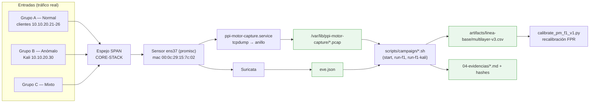

# F1 · Datos y línea base

**Objetivo.** Construir el dataset de línea base a partir de **tráfico real**
observado por espejo SPAN (no sintético), y **recalibrar** el comportamiento del
sistema en la red de operación (FPR 92,4 % → 4,45 %). A diferencia de los
artículos semilla, que descargan un dataset ya hecho, aquí los datos nacen de la
propia red.

## Diagrama

## Flujo

El tráfico de los tres grupos (normal, anómalo desde Kali, mixto) cruza el
**troncal espejado (SPAN)** del CORE-STACK. El **sensor** lo recibe en `ens37` en
modo promiscuo —interfaz identificada por MAC, no por nombre— y lo entrega a dos
consumidores en paralelo: el **anillo de PCAP** (`ppi-motor-capture.service`, 16
archivos × 15 s) y **Suricata**, que emite señales L7 en `eve.json`.

El **orquestador de campañas** (`scripts/campaign/`) ejecuta cada campaña con
preflight y *gates* (G0–G7): nada se corre a mano y nada se borra (los intentos
fallidos se archivan). Los techos de carga están **en el código**
(`scripts/f1/run-benign.sh` aborta fuera de su lista blanca: TCP ≤ 200 Mbit/s,
etc.). Cada campaña produce manifiesto, inventario, contadores, serie temporal
del sensor, segmento EVE y hashes.

El dataset de línea base se acumula en `multilayer-v3.csv` (el anillo solo guarda
~15 min, así que un *timer* extrae y **añade filas** periódicamente). Finalmente
se **recalibra** contra tráfico propio: es lo que baja el FPR de 92,4 % a 4,45 %
y separa una demostración de una medición.

## Entradas y salidas

- **Entradas:** tráfico real (grupos A/B/C) vía espejo SPAN; relojes NTP internos.
- **Salidas:** anillo PCAP, `eve.json`, dataset `multilayer-v3.csv`, evidencias
  `.md` con hashes, parámetros recalibrados.

## Archivos que se tocan / se usan

| Archivo | Tipo | Rol |
|---|---|---|
| `scripts/campaign/{start,stop,run-f1,run-f1-kali,sample-sensor,common}.sh` | `.sh` | Orquestación de campañas (preflight, gates) |
| `scripts/f1/run-benign.sh` | `.sh` | Techos de carga (lista blanca que aborta) |
| `scripts/f1/run_matrix_profile.py`, `validate_matrix.py` | `.py` | Línea base / matrix profile |
| `scripts/dataset/build_f1_dataset.py`, `run_v2_anomaly.py`, `run_v2_anomaly_kali.py` | `.py` | Construcción del dataset y tráfico anómalo |
| `configs/campaigns/{f1-normal-v1,f1-normal-v2,multilayer-v2-normal,multilayer-v2-anomalies}.json` | `.json` | Definición de campañas |
| `configs/sensor/ppi-motor-capture.service` | `.service` | Captura al anillo de PCAP |
| `configs/cyberflow.toml` → `[captura]`, `[red]` | `.toml` | Interfaz, anillo, exclusiones de alcance |
| `/var/lib/ppi-motor-capture/*.pcap` | `.pcap` | Anillo de captura cruda (no entra en Git) |
| `/var/log/suricata/eve.json` | `.json` | Señales L7 (HTTP/DNS/TLS) |
| `artifacts/linea-base/multilayer-v3.csv` | `.csv` | Dataset de línea base (filas = ventanas) |
| `scripts/modeling/calibrate_pm_f1_v1.py` | `.py` | Recalibración del FPR en red real |
| `04-evidencias/cyberflow/{B-espejo-span,D-validacion-espejo,H-ajustes-y-medicion-linea-base,L-recalibracion-seco-sensor1}.md` | `.md` | Evidencia verificable |

➡ Siguiente: [F2 · Preprocesamiento y features](F2-preprocesamiento-y-features.md)
