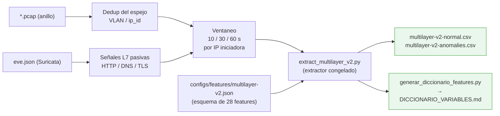

# F2 · Preprocesamiento y features

**Objetivo.** Convertir el tráfico capturado en **28 variables multicapa
(L3/L4/L7)** por IP iniciadora, con un **esquema de features congelado**. Aquí se
unifican lo que los artículos separan en preprocesamiento + extracción +
selección de features.

## Diagrama

## Flujo

El extractor toma los paquetes del anillo y las señales L7 de `eve.json` y, por
cada **IP iniciadora**, calcula variables causales en ventanas de **10, 30 y
60 s**. El **esquema está congelado** en `configs/features/multilayer-v2.json`
(28 variables; de ellas **27 con variación observable** —
`tls_handshake_failure_ratio_60s` queda constante en esta configuración y se
declara como límite). Ejemplos de features: entropía de DNS, ratios de puertos,
tasas por protocolo.

Clave metodológica: el **diccionario de variables se genera desde el extractor
congelado** (`generar_diccionario_features.py`), no se redacta a mano, de modo que
documento y código no pueden divergir. Las **filas del CSV resultante son las
ventanas** que alimentan el dataset y el modelo — por eso F2 va **antes** que la
construcción del dataset.

## Entradas y salidas

- **Entradas:** anillo PCAP (`*.pcap`), `eve.json`, esquema `multilayer-v2.json`.
- **Salidas:** `multilayer-v2-*.csv` (28 features por ventana), diccionario y
  datasheet de variables.

## Archivos que se tocan / se usan

| Archivo | Tipo | Rol |
|---|---|---|
| `scripts/features/extract_multilayer_v2.py` | `.py` | Extractor congelado (paquetes → vectores) |
| `configs/features/{multilayer-v1,multilayer-v2,multilayer-v3,descripciones}.json` | `.json` | Esquema de features (v2 es el congelado) |
| `scripts/dataset/build_multilayer_v2_dataset.py`, `audit_multilayer_v2.py` | `.py` | Construcción y auditoría del dataset |
| `scripts/entregables/generar_diccionario_features.py` | `.py` | Genera el diccionario desde el extractor |
| `docs/dataset/DATASHEET_MULTILAYER_V2.md`, `DICCIONARIO_VARIABLES.md` | `.md` | Datasheet y diccionario de las 28 variables |
| `artifacts/dataset/multilayer-v2-normal.csv`, `multilayer-v2-anomalies.csv` | `.csv` | Dataset derivado (fila = ventana) |
| `configs/cyberflow.toml` → `esquema`, `eve` | `.toml` | Rutas del esquema de features y de `eve.json` |

➡ Anterior: [F1](F1-datos-y-linea-base.md) · Siguiente: [F3 · Modelado híbrido](F3-modelado-hibrido.md)
