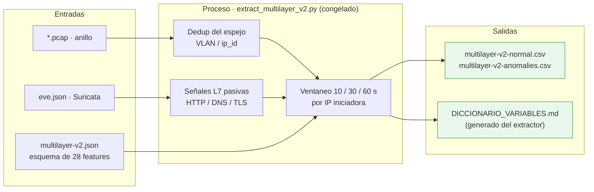

# F2 · Preprocesamiento y features

**Objetivo.** Convertir el tráfico capturado en **28 variables multicapa
(L3/L4/L7)** por IP iniciadora, con un **esquema de features congelado**. Aquí se
unifican lo que los artículos separan en preprocesamiento + extracción +
selección de features. Va **antes** que el dataset: las filas del CSV **son** las
ventanas que produce el extractor.

## Diagrama



## Flujo

El extractor toma los paquetes del anillo y las señales L7 de `eve.json` y, por
cada **IP iniciadora**, calcula variables causales en ventanas de **10, 30 y
60 s** (entropía de DNS, ratios de puertos, tasas por protocolo…). El **esquema
está congelado** en `configs/features/multilayer-v2.json`: **28 variables**, de
las cuales **27 tienen variación observable** (`tls_handshake_failure_ratio_60s`
queda constante en esta configuración y se declara como límite).

Clave metodológica: el **diccionario se genera desde el extractor congelado**
(`generar_diccionario_features.py`), no se redacta a mano, así documento y código
no pueden divergir. La **capa 2** (ARP) entra en la dedup pero **no** en el
scoring de v2; está prevista para v3 (no desplegado) → trabajo futuro.

## Cómo se ejecuta

```bash
# Extracción de features (produce las filas del dataset)
python3 scripts/dataset/build_multilayer_v2_dataset.py
python3 scripts/dataset/audit_multilayer_v2.py          # auditoría del esquema
# Diccionario desde el extractor congelado (no a mano)
python3 scripts/entregables/generar_diccionario_features.py
```

## Cifras / evidencia clave

- **28 features** multicapa (L3/L4/L7); **27 observables**, 1 constante declarada.
- Ventanas de **10 / 30 / 60 s** por IP iniciadora (features causales).
- Hashes publicados en `docs/dataset/SHA256SUMS`:
  `configs/features/multilayer-v2.json` y `scripts/features/extract_multilayer_v2.py`.
- Datasheet y diccionario: `docs/dataset/DATASHEET_MULTILAYER_V2.md`,
  `DICCIONARIO_VARIABLES.md`.

## Entradas y salidas

- **Entradas:** anillo PCAP (`*.pcap`), `eve.json`, esquema `multilayer-v2.json`.
- **Salidas:** `multilayer-v2-*.csv` (28 features por ventana), diccionario y
  datasheet de variables.

## Archivos que se tocan / se usan

| Archivo | Tipo | Rol |
|---|---|---|
| `scripts/features/extract_multilayer_v2.py` | `.py` | Extractor congelado (paquetes → vectores) |
| `configs/features/{multilayer-v1,multilayer-v2,multilayer-v3,descripciones}.json` | `.json` | Esquema de features (v2 es el congelado) |
| `scripts/dataset/build_multilayer_v2_dataset.py`, `audit_multilayer_v2.py` | `.py` | Construcción y auditoría del dataset |
| `scripts/entregables/generar_diccionario_features.py` | `.py` | Genera el diccionario desde el extractor |
| `docs/dataset/DATASHEET_MULTILAYER_V2.md`, `DICCIONARIO_VARIABLES.md` | `.md` | Datasheet y diccionario de las 28 variables |
| `artifacts/dataset/multilayer-v2-normal.csv`, `multilayer-v2-anomalies.csv` | `.csv` | Dataset derivado (fila = ventana) |
| `configs/cyberflow.toml` → `esquema`, `eve` | `.toml` | Rutas del esquema de features y de `eve.json` |

➡ Anterior: [F1](F1-datos-y-linea-base.md) · Siguiente: [F3 · Modelado híbrido](F3-modelado-hibrido.md)
