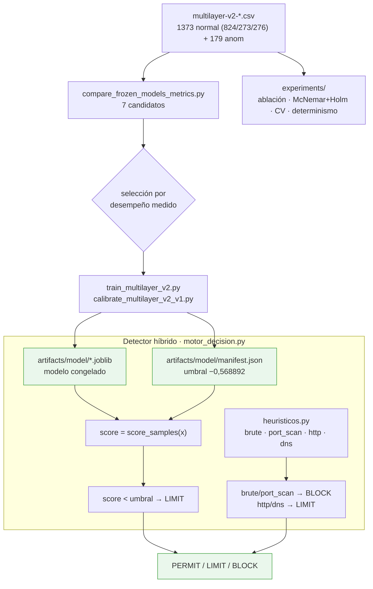

# F3 · Modelado híbrido

**Objetivo.** Comparar **7 modelos** candidatos, congelar el elegido
(**IsolationForest recalibrado**, umbral **−0,568892** vía `score_samples`, leído
del `manifest.json`) y combinarlo con **heurísticos deterministas** (fuerza bruta,
escaneo de puertos, abuso HTTP, entropía DNS). El resultado es un **detector
híbrido** (ML + reglas), no un clasificador solo. La ablación demuestra que
**ninguno basta por separado**.

## Diagrama



## Flujo

Sobre el dataset de features (**1 373 ventanas normales** en 824/273/276 y **179
de anomalía**) se **comparan 7 modelos** y se elige por **desempeño empírico
medido**. El modelo se **entrena, calibra y congela**: `.joblib` + `manifest.json`
con el **umbral** (no está cableado en el código; el motor y el panel lo leen de
ahí). La robustez se sostiene con **ablación**, **significancia** (McNemar con
corrección de Holm sobre 21 pares), **validación cruzada / estabilidad** del
umbral y **determinismo** (semillas).

El ML por sí solo no basta: el **modelo** marca la anomalía → **LIMIT**; los
**heurísticos** confirmados (fuerza bruta, escaneo) → **BLOCK**, y cubren los
huecos del modelo (el modelo no "ve" DNS). `motor_decision.py` **combina** ambos.

## Cómo se ejecuta

```bash
python3 scripts/analysis/compare_frozen_models_metrics.py        # 7 modelos
python3 scripts/modeling/train_multilayer_v2.py
python3 scripts/modeling/calibrate_multilayer_v2_v1.py
python3 scripts/modeling/experiments/ablacion_multicapa.py       # ablación
python3 scripts/modeling/experiments/significancia_modelos.py    # McNemar+Holm
```

## Cifras / evidencia clave

- **Ablación (aporte de cada componente):** modelo solo **6/9** · heurísticos
  solos **7/9** · **combinado 9/9**. Ninguno basta solo → el **híbrido** es el
  aporte. (`31-ABLACION-RESULTADO.md`, con `30-metricas.py`.)
- **Heurísticos:** ~0,01–0,08 % de falsos positivos en tráfico normal (712 450
  ventanas).
- **Umbral congelado:** −0,568892 (`score_samples` del IsolationForest
  recalibrado), leído de `manifest.json`.
- **Runbook de congelado:** `04-evidencias/cyberflow/RUNBOOK-CONGELAR-modelo.md`.

## Entradas y salidas

- **Entradas:** `multilayer-v2-*.csv`.
- **Salidas:** modelo congelado (`.joblib`), `manifest.json` (umbral + metadata),
  MODEL_CARD / SYSTEM_CARD, runbook.

## Archivos que se tocan / se usan

| Archivo | Tipo | Rol |
|---|---|---|
| `scripts/analysis/compare_frozen_models_metrics.py` | `.py` | Comparación de los 7 modelos |
| `scripts/modeling/train_multilayer_v2.py`, `calibrate_multilayer_v2_v1.py` | `.py` | Entrenamiento y calibración |
| `scripts/modeling/experiments/{ablacion_multicapa,significancia_modelos,validacion_cruzada_estabilidad,verificar_determinismo,diagnose_v2_pipeline}.py` | `.py` | Ablación, significancia, CV, determinismo |
| `scripts/engine/heuristicos.py` | `.py` | Heurísticos deterministas (brute/port_scan/http/dns) |
| `scripts/engine/motor_decision.py` | `.py` | Combina modelo + reglas → decisión |
| `artifacts/model/*.joblib` | `.joblib` | Modelo congelado serializado |
| `artifacts/model/manifest.json` | `.json` | Umbral (−0,568892) y metadata del congelado |
| `docs/dataset/MODEL_CARD_*.md`, `SYSTEM_CARD_MOTOR.md` | `.md` | Ficha del modelo y del sistema |
| `04-evidencias/cyberflow/RUNBOOK-CONGELAR-modelo.md` | `.md` | Procedimiento de congelado |
| `configs/cyberflow.toml` → `[motor]` `umbral`, `modelo`, `manifiesto`, `esquema` | `.toml` | Rutas y umbral del motor |

> El `cyberflow.toml` del despliegue aún referencia el candidato OCSVM del
> congelado anterior; la estructura vigente (y la Vista 1) usa el **IsolationForest
> recalibrado híbrido**. El umbral siempre se lee del `manifest.json`.

➡ Anterior: [F2](F2-preprocesamiento-y-features.md) · Siguiente: [F4 · Experimento y evaluación](F4-experimento-y-evaluacion.md)
