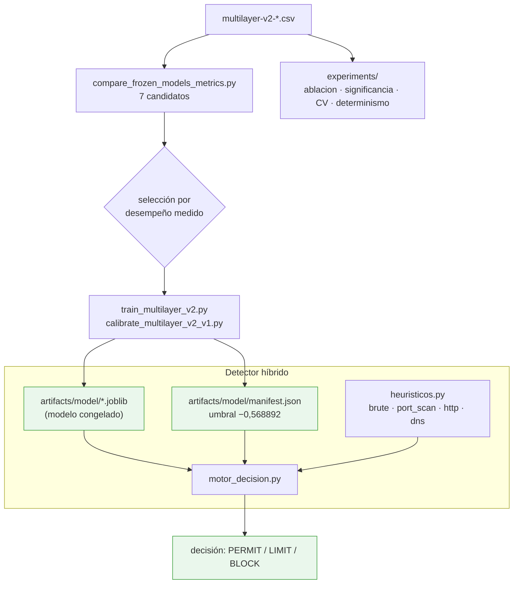

# F3 · Modelado híbrido

**Objetivo.** Comparar **7 modelos** candidatos, congelar el elegido
(**IsolationForest recalibrado**, umbral **−0,568892** leído del `manifest.json`)
y combinarlo con **heurísticos deterministas** (fuerza bruta, escaneo de puertos,
abuso HTTP, entropía DNS). El resultado es un **detector híbrido** (ML + reglas),
no solo un clasificador.

## Diagrama

## Flujo

Sobre el dataset de features se **comparan 7 modelos**
(`compare_frozen_models_metrics.py`) y se elige por **desempeño empírico medido**,
no por una regla por defecto. El modelo se **entrena y calibra**
(`train_multilayer_v2.py`, `calibrate_multilayer_v2_v1.py`) y se **congela**: el
artefacto `.joblib` + el `manifest.json`, donde vive el **umbral** (no está
cableado en el código; el motor y el panel lo leen de ahí).

La robustez del congelado se sostiene con experimentos: **ablación** multicapa,
**significancia** entre modelos (McNemar con corrección de Holm), **validación
cruzada / estabilidad** del umbral y **determinismo** (semillas). El ML por sí
solo no basta: `heuristicos.py` aporta reglas deterministas para patrones claros
(fuerza bruta, escaneo, etc.), y `motor_decision.py` **combina** la puntuación del
modelo con esas reglas para producir la decisión final.

## Entradas y salidas

- **Entradas:** `multilayer-v2-*.csv`.
- **Salidas:** modelo congelado (`.joblib`), `manifest.json` (umbral + metadata),
  MODEL_CARD / SYSTEM_CARD, runbook de congelado.

## Archivos que se tocan / se usan

| Archivo | Tipo | Rol |
|---|---|---|
| `scripts/analysis/compare_frozen_models_metrics.py` | `.py` | Comparación de los 7 modelos |
| `scripts/modeling/train_multilayer_v2.py`, `calibrate_multilayer_v2_v1.py` | `.py` | Entrenamiento y calibración |
| `scripts/modeling/experiments/{ablacion_multicapa,significancia_modelos,validacion_cruzada_estabilidad,verificar_determinismo,diagnose_v2_pipeline}.py` | `.py` | Ablación, significancia, CV, determinismo |
| `scripts/engine/heuristicos.py` | `.py` | Heurísticos deterministas (brute/port_scan/http/dns) |
| `scripts/engine/motor_decision.py` | `.py` | Combina modelo + reglas → decisión |
| `artifacts/model/*.joblib` | `.joblib` | Modelo congelado serializado |
| `artifacts/model/manifest.json` | `.json` | Umbral (−0,568892) y metadata del congelado |
| `docs/dataset/MODEL_CARD_*.md`, `SYSTEM_CARD_MOTOR.md` | `.md` | Ficha del modelo y del sistema |
| `04-evidencias/cyberflow/RUNBOOK-CONGELAR-modelo.md` | `.md` | Procedimiento de congelado |
| `configs/cyberflow.toml` → `[motor]` `umbral`, `modelo`, `manifiesto`, `esquema` | `.toml` | Rutas y umbral del motor |

> Nota: el `cyberflow.toml` del despliegue aún referencia el candidato OCSVM del
> congelado anterior; la estructura metodológica vigente (y la Vista 1) usa el
> **IsolationForest recalibrado híbrido**. El umbral siempre se lee del
> `manifest.json`, no del código.

➡ Anterior: [F2](F2-preprocesamiento-y-features.md) · Siguiente: [F4 · Experimento y evaluación](F4-experimento-y-evaluacion.md)
