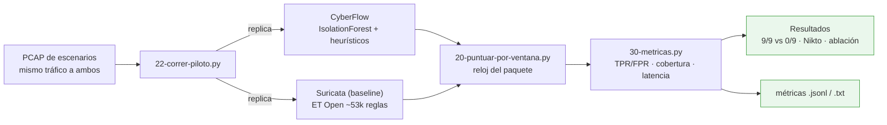

# F4 · Experimento y evaluación

**Objetivo.** Medir a CyberFlow **frente a Suricata** de forma justa: se reproduce
**el mismo PCAP** a ambos detectores anclando el **reloj del paquete** (no el de
pared). Resultado principal sobre ataques **sin firma**: **9/9** (CyberFlow) vs
**0/9** (Suricata). Se reportan también el episodio de control con firma (Nikto),
la ablación interna y los límites.

## Diagrama



## Flujo

El método está fijado en `19-METODO-REPLAY-PCAP.md`: un **único PCAP** de
escenarios se **reproduce** a ambos detectores (`22-correr-piloto.py`). El
**scorer** (`20-puntuar-por-ventana.py`) alinea los eventos por el **reloj del
paquete** y puntúa **por ventana**; `30-metricas.py` calcula TPR/FPR, cobertura y
latencia. Suricata es el **baseline** con **ET Open** (~53k reglas) por defecto,
`-sT`, `HOME_NET=DMZ`.

La lectura honesta: CyberFlow detecta lo que **no tiene firma**; Suricata, por
diseño, no. En un ataque **con firma** (Nikto) Suricata gana en tiempo → son
**complementarios**, no competidores.

## Cómo se ejecuta

```bash
cd 02-metodologia/comparacion-cyberflow-suricata/
python3 22-correr-piloto.py            # replay del PCAP a CyberFlow y Suricata
python3 20-puntuar-por-ventana.py      # scorer por ventana (reloj del paquete)
python3 30-metricas.py                 # TPR/FPR, cobertura, latencia, ablación
```

## Cifras / evidencia clave

| Familia (sin firma) | CyberFlow | Suricata (ET Open) |
|---|---|---|
| DNS alta entropía (DGA) | **3/3** | 0/3 |
| Flood HTTP | **3/3** | 0/3 |
| Escaneo de puertos | **3/3** | 0/3 |
| **Total** | **9/9** | **0/9** |

- **Control con firma (Nikto):** CyberFlow 12,0 s (conducta) · Suricata **3,4 s**
  (firma) → complementarios. (`28-RESULTADO-NIKTO.md`.)
- **Ablación:** modelo 6/9 · heurísticos 7/9 · **híbrido 9/9**.
  (`31-ABLACION-RESULTADO.md`.)
- **4ª familia (fuerza bruta real, 401):** confirmada en vivo (`brute_force`→BLOCK,
  "240 req HTTP/60s con 100 % de fallo de auth").
- **Límites declarados:** N=3 por familia (piloto ampliado; para tesis conviene
  N mayor); el 0/9 de Suricata es con ET Open por defecto (alcance, no absoluto).
- **Resumen para defensa:** `32-RESUMEN-RESULTADOS.md`.

## Entradas y salidas

- **Entradas:** PCAP de escenarios (`.pcap`), reglas ET Open, `eve.json` de
  Suricata.
- **Salidas:** scores por ventana (`.jsonl`/`.csv`), métricas, documentos de
  resultados (`.md`).

## Archivos que se tocan / se usan

Todos bajo `02-metodologia/comparacion-cyberflow-suricata/`:

| Archivo | Tipo | Rol |
|---|---|---|
| `22-correr-piloto.py` | `.py` | Orquesta el replay a ambos detectores |
| `20-puntuar-por-ventana.py` | `.py` | Scorer por ventana (reloj del paquete) |
| `30-metricas.py` | `.py` | Cálculo de métricas comparativas |
| `13-preparar-prueba.py`, `08-probar-ntp.py` | `.py` | Preparación del escenario y NTP |
| `06-configurar-captura.sh`, `07-activar-promisc.sh`, `14-aplicar-config-suricata.sh`, `15-piloto-pasivo-suricata.sh`, `11-instalar-suricata-offline.sh` | `.sh` | Captura y despliegue de Suricata |
| `19-METODO-REPLAY-PCAP.md`, `12-REGLAS-ET-OPEN.md`, `29-PLAN-EVALUACION-COMPARATIVA.md` | `.md` | Método, reglas y plan de evaluación |
| `23/25/26-RESULTADOS*.md`, `27/28-*NIKTO.md`, `31-ABLACION-RESULTADO.md`, `32-RESUMEN-RESULTADOS.md` | `.md` | Resultados verificables |
| `03-METRICAS-Y-EVIDENCIAS.md` | `.md` | Consolidado de métricas y evidencias |
| `*.pcap`, `eve.json` | `.pcap` / `.json` | Entradas de la comparación |

➡ Anterior: [F3](F3-modelado-hibrido.md) · Siguiente: [F5 · Respuesta / enforcement ◆](F5-respuesta-enforcement.md)
