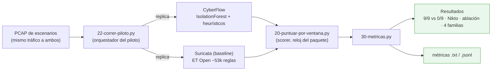

# F4 · Experimento y evaluación

**Objetivo.** Medir a CyberFlow **frente a Suricata** de forma justa: se reproduce
**el mismo PCAP** a ambos detectores anclando el **reloj del paquete** (no el de
pared). Se reportan TPR/FPR/cobertura/latencia. Resultado principal: **9 de 9
ataques detectados por CyberFlow vs 0 de 9 por Suricata**, más el episodio Nikto,
la **ablación 6/7/9** y las **4 familias** de ataque.

## Diagrama

## Flujo

El método está fijado en `19-METODO-REPLAY-PCAP.md`: un **único PCAP** de
escenarios de ataque se **reproduce** tanto a CyberFlow como a Suricata
(`22-correr-piloto.py`). Para que la comparación sea justa, el **scorer**
(`20-puntuar-por-ventana.py`) alinea los eventos por el **reloj del paquete**, no
por la hora de ejecución, y puntúa **por ventana**. `30-metricas.py` calcula
TPR/FPR, cobertura y latencia y arma los cuadros comparativos.

Suricata se usa como **baseline** con el conjunto **ET Open** (~53k reglas,
`12-REGLAS-ET-OPEN.md`). Los resultados quedan en documentos verificables: DNS,
batería N3, Nikto, ablación y el resumen. El NTP interno (`08-probar-ntp.py`)
garantiza que los relojes no contaminen la medición.

## Entradas y salidas

- **Entradas:** PCAP de escenarios, reglas ET Open, `eve.json` de Suricata.
- **Salidas:** scores por ventana, métricas comparativas, documentos de
  resultados (`.md`, `.jsonl`/`.txt`).

## Archivos que se tocan / se usan

Todos bajo `02-metodologia/comparacion-cyberflow-suricata/`:

| Archivo | Tipo | Rol |
|---|---|---|
| `22-correr-piloto.py` | `.py` | Orquesta el replay a ambos detectores |
| `20-puntuar-por-ventana.py` | `.py` | Scorer por ventana (reloj del paquete) |
| `30-metricas.py` | `.py` | Cálculo de métricas comparativas |
| `13-preparar-prueba.py`, `08-probar-ntp.py` | `.py` | Preparación del escenario y NTP |
| `06-configurar-captura.sh`, `07-activar-promisc.sh`, `14-aplicar-config-suricata.sh`, `15-piloto-pasivo-suricata.sh`, `11-instalar-suricata-offline.sh` | `.sh` | Captura y despliegue de Suricata |
| `19-METODO-REPLAY-PCAP.md`, `12-REGLAS-ET-OPEN.md`, `29-PLAN-EVALUACION-COMPARATIVA.md` | `.md` | Método, reglas y plan de evaluación |
| `23-RESULTADO-PILOTO-E3-DNS.md`, `25-RESULTADOS-BATERIA.md`, `26-BATERIA-N3-RESULTADOS.md`, `27/28-*NIKTO.md`, `31-ABLACION-RESULTADO.md`, `32-RESUMEN-RESULTADOS.md` | `.md` | Resultados verificables |
| `03-METRICAS-Y-EVIDENCIAS.md` | `.md` | Consolidado de métricas y evidencias |
| `*.pcap`, `eve.json` | `.pcap` / `.json` | Entradas de la comparación |

➡ Anterior: [F3](F3-modelado-hibrido.md) · Siguiente: [F5 · Respuesta / enforcement ◆](F5-respuesta-enforcement.md)
