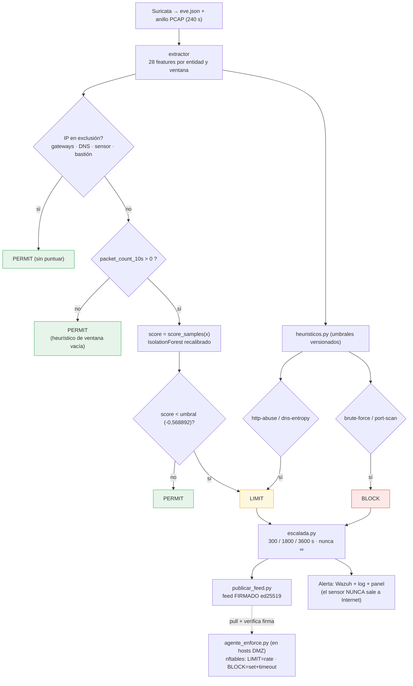

# F5 · Respuesta / enforcement ◆ (aporte)

**Objetivo.** Convertir la **decisión** del motor en **acción real**: PERMIT /
LIMIT / BLOCK, distribuida como **feed firmado (ed25519)** que los **agentes en
los hosts** aplican por **nftables** con caducidad escalada. Como el sensor
observa por **espejo SPAN**, no está en el camino del tráfico: **la acción la
aplica el host**, no el sensor. La alerta va **hacia adentro** (Wazuh); el sensor
nunca sale a Internet.

## Diagrama (flujo de decisión real)



## Flujo

`motor_decision.py` combina modelo + heurísticos y resuelve la acción: las IP en
**exclusión** o las ventanas **vacías** son PERMIT; el **score bajo umbral** da
**LIMIT**; los heurísticos de **fuerza bruta / escaneo** dan **BLOCK**, y los de
**abuso HTTP / entropía DNS** dan LIMIT. `escalada.py` fija la **caducidad**
(300 / 1800 / 3600 s, **nunca ∞ automático**) y `publicar_feed.py` emite un
**feed firmado con ed25519**: la red confía en la orden porque está **firmada**,
no por su origen.

Los **agentes en los hosts** (`agente_enforce.py`) hacen *pull* del feed,
**verifican la firma** y aplican **nftables** en su propio kernel (LIMIT = *limit
rate*, BLOCK = *set + timeout*). En paralelo se emite **alerta a Wazuh + log +
panel**. Diseño en `DISENO-ENFORCEMENT.md` / `flujo-decision.md`.

## Cómo se ejecuta

```bash
# En el sensor: publicar el feed firmado (lo genera el motor)
python3 scripts/engine/publicar_feed.py
# En cada host DMZ: agente que verifica firma y aplica nftables
python3 scripts/enforce/agente_enforce.py
# Activar bloqueo real desde la config (vs solo observación):
#   [motor] modo = "bloqueo"   (añade --enforce)   ·   bloqueo_segundos = 120
```

## Cifras / evidencia clave

- **Respuesta confirmada en vivo:** corte real 200→000; `port_scan`→BLOCK (3/3
  tras la mejora `VERSION_UMBRALES 2026-10-06.2`, `flow≥200 & syn≤0,1`) y
  `brute_force`→BLOCK (401, "240 req HTTP/60s, 100 % fallo de auth").
- **Tiempos (honestos):** detección ~2–40 s; respuesta total hasta BLOCK
  ~1–2,5 min (dominada por la cadencia del feed firmado, configurable).
- **Falsos positivos de heurísticos:** ~0,01–0,08 % (712 450 ventanas).
- **Evidencia:** `04-evidencias/cyberflow/{N-e2e-enforcement,
  O-enforcement-vivo-campana-ataque}.md`.

## Entradas y salidas

- **Entradas:** decisión del motor (LIMIT/BLOCK), clave privada ed25519, config
  `[motor]`.
- **Salidas:** feed firmado (`.json` + firma), reglas nftables en los hosts (IP
  con caducidad), alerta Wazuh, `logs/motor_decision.log`.

## Archivos que se tocan / se usan

| Archivo | Tipo | Rol |
|---|---|---|
| `scripts/engine/motor_decision.py` | `.py` | Produce la decisión (PERMIT/LIMIT/BLOCK) |
| `scripts/engine/escalada.py` | `.py` | Caducidad escalada (300/1800/3600 s) |
| `scripts/engine/publicar_feed.py`, `feed.py` | `.py` | Feed firmado ed25519 (publicado por el sensor) |
| `scripts/enforce/agente_enforce.py` | `.py` | En hosts: verifica firma y aplica nftables |
| `ppi-enforce` (helper raíz versionado) | helper | Única vía con privilegio para el bloqueo |
| `01-arquitectura/DISENO-ENFORCEMENT.md`, `flujo-decision.md` | `.md` | Diseño de la respuesta |
| `04-evidencias/cyberflow/{N-e2e-enforcement,O-enforcement-vivo-campana-ataque}.md` | `.md` | Evidencia de enforcement real |
| `configs/cyberflow.toml` → `[motor]` `modo`, `bloqueo_segundos` | `.toml` | Observación vs bloqueo, caducidad |
| `logs/motor_decision.log` | `.log` | Registro de cada decisión |

➡ Anterior: [F4](F4-experimento-y-evaluacion.md) · Siguiente: [F6 · Despliegue / operación ◆](F6-despliegue-y-operacion.md)
