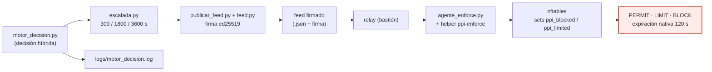

# F5 · Respuesta / enforcement ◆ (aporte)

**Objetivo.** Convertir la **decisión** del motor en **acción real** sobre la red:
PERMIT / LIMIT / BLOCK, distribuida como **feed firmado (ed25519)** y aplicada por
**nftables** con expiración. Es la primera de las tres fases que el estado del
arte casi nunca alcanza.

## Diagrama

## Flujo

Cuando `motor_decision.py` resuelve un `ALERT` real (no el heurístico de ventana
sin tráfico), `escalada.py` fija la severidad/duración (300 / 1800 / 3600 s) y
`publicar_feed.py` emite un **feed firmado con ed25519**: la red confía en la
orden porque está **firmada**, no por su origen. El feed llega por el **relay**
del bastión y el **agente de enforcement** (`agente_enforce.py`, con el helper
raíz versionado `ppi-enforce`) lo traduce a reglas **nftables** sobre los *sets*
`ppi_blocked` / `ppi_limited`, con **expiración nativa** (120 s por defecto).

Diseño declarado (`DISENO-ENFORCEMENT.md`, `flujo-decision.md`): el bloqueo se
aplica en el propio sensor cuando actúa como router LAN↔DMZ; en modo espejo
(SPAN) el sensor **no** está en el camino, por eso `[motor] modo` separa
`"observacion"` (solo puntúa) de `"bloqueo"` (`--enforce`). Cada decisión queda en
`logs/motor_decision.log`.

## Entradas y salidas

- **Entradas:** decisión del motor (`ALERT`), clave privada ed25519, config
  `[motor]` del `cyberflow.toml`.
- **Salidas:** feed firmado, reglas nftables (IP con expiración), registro de
  decisiones.

## Archivos que se tocan / se usan

| Archivo | Tipo | Rol |
|---|---|---|
| `scripts/engine/motor_decision.py` | `.py` | Produce la decisión (ALERT/PERMIT/LIMIT/BLOCK) |
| `scripts/engine/escalada.py` | `.py` | Escalada temporal (300/1800/3600 s) |
| `scripts/engine/publicar_feed.py`, `feed.py` | `.py` | Feed firmado ed25519 |
| `scripts/enforce/agente_enforce.py` | `.py` | Aplica el feed en nftables |
| `ppi-enforce` (helper raíz versionado) | helper | Única vía con privilegio para el bloqueo |
| `01-arquitectura/DISENO-ENFORCEMENT.md`, `flujo-decision.md` | `.md` | Diseño de la respuesta |
| `04-evidencias/cyberflow/{N-e2e-enforcement,O-enforcement-vivo-campana-ataque}.md` | `.md` | Evidencia de enforcement real |
| `configs/cyberflow.toml` → `[motor]` `modo`, `bloqueo_segundos` | `.toml` | Observación vs bloqueo, expiración |
| `logs/motor_decision.log` | `.log` | Registro de cada decisión |

➡ Anterior: [F4](F4-experimento-y-evaluacion.md) · Siguiente: [F6 · Despliegue / operación ◆](F6-despliegue-y-operacion.md)
