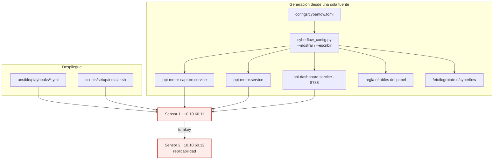

# F6 · Despliegue / operación ◆ (aporte)

**Objetivo.** Llevar el sistema a **operación real sobre el sensor**: servicios
systemd generados desde una **config única**, enforcement **en vivo**, y
**replicabilidad** (segundo sensor *turnkey*). La operación real —no el
laboratorio— es la que destapó y cerró problemas de disco, logs y privilegios.

## Diagrama



## Flujo

Todo lo que cambia entre instalaciones vive en **`cyberflow.toml`**; las unidades
systemd **se generan** desde ahí con `cyberflow_config.py`, en vez de cablear
interfaz, BPF o rutas dentro de los `.service`. El **instalador** y los
**playbooks Ansible** (`00`–`09`) dejan el sensor operativo: captura
(`ppi-motor-capture`), motor (`ppi-motor`) y panel (`ppi-dashboard`, 8788, solo
lectura). El despliegue se **replicó** en un segundo sensor (turnkey).

La operación real trajo tres arreglos medidos: **poda del anillo** cada 5 min
(tcpdump con nombre fechado no reutiliza nombres → crecía sin fin), **rotación de
logs** (`logrotate` solo cubría Suricata) y **privilegio mínimo** del operador
(se quitó `NOPASSWD: ALL`). Además, la **exclusión de alcance** (VRRP/CARP y
pfsync, redes de gestión) evita puntuar las interfaces del cortafuegos.

## Cómo se ejecuta

```bash
python3 scripts/setup/cyberflow_config.py --mostrar      # previsualiza unidades
sudo python3 scripts/setup/cyberflow_config.py --escribir  # las escribe
sudo scripts/setup/instalar.sh                            # instalación turnkey
sudo systemctl enable --now ppi-motor-capture ppi-motor ppi-dashboard
```

## Cifras / evidencia clave

- **Poda del anillo:** 404 MB → **8,8 MB** (sin afectar al motor).
- **Logs:** `/etc/logrotate.d/cyberflow` (diario, 200 MB, 14 copias); antes
  86 939 líneas duplicadas / 320 MB por registro triplicado.
- **Alcance:** exclusión 112 (VRRP/CARP) y 240 (pfsync) → de 14/23 entidades
  "fantasma" a 5; **decisión de alcance a declarar en la tesis**.
- **Tiempos en operación:** detección ~2–40 s; respuesta hasta BLOCK ~1–2,5 min.
- **Replicabilidad:** segundo sensor turnkey
  (`K-despliegue-turnkey-sensor2-2026-09-29.md`).
- **Evidencia:** `04-evidencias/cyberflow/{I-motor-desplegado, K-despliegue-turnkey-sensor2, M-deteccion-kali-sensor1}.md`.

## Entradas y salidas

- **Entradas:** `cyberflow.toml`, artefactos del modelo (`.joblib`, `manifest`).
- **Salidas:** servicios systemd activos, panel, logs rotados, segundo sensor,
  evidencias de despliegue.

## Archivos que se tocan / se usan

| Archivo | Tipo | Rol |
|---|---|---|
| `configs/cyberflow.toml` | `.toml` | Config única de todo el despliegue |
| `scripts/setup/cyberflow_config.py` | `.py` | Genera unidades systemd desde el `.toml` |
| `configs/sensor/{ppi-motor,ppi-motor-capture,ppi-dashboard}.service` | `.service` | Unidades del motor, captura y panel |
| `scripts/setup/instalar.sh`, `desinstalar.sh` | `.sh` | Instalación / desinstalación turnkey |
| `ansible/playbooks/0{0..9}-*.yml` | `.yml` | Aprovisionamiento (conectividad, servicios, captura, Kali) |
| `/etc/logrotate.d/cyberflow` | generado | Rotación del registro de decisiones |
| `scripts/storage/audit_evidence_disk.py` | `.py` | Auditoría del disco de evidencia |
| `REPLICACION.md`, `docs/INSTALACION.md` | `.md` | Guías de despliegue |
| `01-arquitectura/mapa-servicios.md`, `red-y-seguridad.md` | `.md` | Topología de servicios y seguridad |
| `04-evidencias/cyberflow/{I,K,M}-*.md` | `.md` | Evidencia de despliegue y operación |

➡ Anterior: [F5](F5-respuesta-enforcement.md) · Siguiente: [F7 · Validación ◆](F7-validacion.md)
