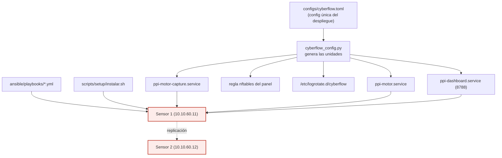

# F6 · Despliegue / operación ◆ (aporte)

**Objetivo.** Llevar el sistema a **operación real sobre el sensor**: servicios
systemd, instalación *turnkey* generada desde una **config única**, enforcement
**en vivo**, y **replicabilidad** (segundo sensor). Tiempos medidos en operación:
detección **2–40 s**, respuesta **1–2,5 min**.

## Diagrama

## Flujo

Todo lo que cambia entre instalaciones vive en **`cyberflow.toml`**; las unidades
systemd **se generan** desde ahí con `cyberflow_config.py` (`--mostrar` /
`--escribir`), en vez de cablear interfaz, BPF o rutas dentro de los `.service`.
El **instalador** (`scripts/setup/instalar.sh`) y los **playbooks Ansible**
(`00`–`09`) dejan el sensor operativo *turnkey*: captura (`ppi-motor-capture`),
motor (`ppi-motor`) y panel (`ppi-dashboard`, puerto 8788, solo lectura).

La operación real trajo problemas que se midieron y cerraron: **poda del anillo**
cada 5 min (404 MB → 8,8 MB), **rotación de logs** (`/etc/logrotate.d/cyberflow`),
**privilegio mínimo** del operador (sin `NOPASSWD: ALL`) y **exclusiones de
alcance** (VRRP/CARP y pfsync, redes de gestión). El despliegue se **replicó** en
un segundo sensor (turnkey), lo que sostiene la afirmación de replicabilidad.

## Entradas y salidas

- **Entradas:** `cyberflow.toml`, artefactos del modelo (`.joblib`, `manifest`).
- **Salidas:** servicios activos, panel, logs rotados, segundo sensor replicado,
  evidencias de despliegue.

## Archivos que se tocan / se usan

| Archivo | Tipo | Rol |
|---|---|---|
| `configs/cyberflow.toml` | `.toml` | Config única de todo el despliegue |
| `scripts/setup/cyberflow_config.py` | `.py` | Genera unidades systemd desde el `.toml` |
| `configs/sensor/{ppi-motor,ppi-motor-capture,ppi-dashboard}.service` | `.service` | Unidades del motor, captura y panel |
| `scripts/setup/instalar.sh`, `desinstalar.sh` | `.sh` | Instalación / desinstalación turnkey |
| `ansible/playbooks/00-…09-*.yml` | `.yml` | Aprovisionamiento (conectividad, servicios, captura, Kali) |
| `/etc/logrotate.d/cyberflow` | generado | Rotación del registro de decisiones |
| `REPLICACION.md`, `docs/INSTALACION.md` | `.md` | Guías de despliegue |
| `01-arquitectura/mapa-servicios.md`, `red-y-seguridad.md` | `.md` | Topología de servicios y seguridad |
| `04-evidencias/cyberflow/{I-motor-desplegado,K-despliegue-turnkey-sensor2,M-deteccion-kali-sensor1}.md` | `.md` | Evidencia de despliegue y operación |

➡ Anterior: [F5](F5-respuesta-enforcement.md) · Siguiente: [F7 · Validación ◆](F7-validacion.md)
