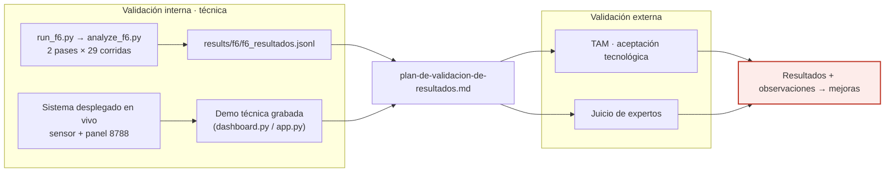

# F7 · Validación ◆ (aporte)

**Objetivo.** Cerrar la metodología con **validación interna** (demo técnica
grabada del sistema funcionando, respaldada por las corridas operacionales) y
**validación externa** (**TAM** + **juicio de expertos**). Casi ningún artículo
del estado del arte valida en operación real ni con usuarios/expertos. Parte del
aporte es la **honestidad**: se declaran las limitaciones medidas.

## Diagrama



## Flujo

La **validación interna** es **técnica**: se demuestra el sistema funcionando en
vivo (panel + enforcement) y se respalda con las **corridas operacionales**
(`run_f6.py` / `analyze_f6.py`). Se conservan incluso los pases descartados
(`f6_resultados.pass1-contaminado.jsonl`) y se **declaran las limitaciones
medidas** — no se esconden.

La **validación externa** usa **TAM** y **juicio de expertos**, con el **guion de
observación** y el **plan de validación** como instrumentos; el panel de solo
lectura sirve de soporte a la demo. (El instrumento SUS existe como artefacto,
pero el plan vigente centra la externa en TAM + expertos.)

## Cómo se ejecuta

```bash
python3 scripts/f6/run_f6.py        # corridas operacionales con el motor activo
python3 scripts/f6/analyze_f6.py    # análisis → results/f6/f6_resultados.jsonl
python3 scripts/entregables/generar_plan_validacion_word.py   # plan (entregable)
```

## Cifras / evidencia clave

- **Robustez operacional:** 2 pases × 29 corridas + 2 de aislamiento = **cero
  caídas en 58 corridas** (55 con verificación explícita de servicios).
- **Lead time** (detección + bloqueo inline): mediano **8,0 s** (rango
  6,1–13,7 s, n = 8); heurístico de fuerza bruta disparando en producción.
- **Limitación #1 (la que más pesa):** el FPR benigno de **4,71 %** en laboratorio
  **no se sostiene** en operación: **25,81 %** (pase 1) y **22,97 %** (pase 2); un
  `iperf-tcp 200M` legítimo llegó a bloquear a un cliente. Declarada, no corregida
  (corregirla exigiría recalibrar e invalidar el congelamiento).
- **Limitación #2:** el motor se atrasa bajo carga sostenida (hasta **161 s**) por
  reparsear el anillo completo en cada ciclo.
- **Artefacto:** `results/f6/f6_resultados.jsonl` (+ `pass1-contaminado.jsonl`,
  conservado a propósito).

## Entradas y salidas

- **Entradas:** sistema desplegado en vivo (F6), corridas operacionales,
  validadores (expertos / usuarios).
- **Salidas:** `f6_resultados.jsonl`, resultados TAM / juicio de expertos, plan de
  validación, grabación de la demo, observaciones para mejoras.

## Archivos que se tocan / se usan

| Archivo | Tipo | Rol |
|---|---|---|
| `scripts/f6/run_f6.py`, `analyze_f6.py` | `.py` | Corridas operacionales y su análisis |
| `results/f6/f6_resultados.jsonl` (+ `pass1-contaminado.jsonl`) | `.jsonl` | Resultados (se conserva lo descartado) |
| `scripts/engine/dashboard.py`, `dashboard/app.py` | `.py` | Panel de solo lectura para la demo técnica |
| `scripts/entregables/calcular_sus.py` | `.py` | Cálculo SUS (instrumento disponible) |
| `scripts/entregables/generar_plan_validacion_word.py` | `.py` | Genera el plan de validación |
| `03-entregables/07-plan-de-validacion/plan-de-validacion-de-resultados.md` | `.md` | Plan de validación (interna + externa) |
| `03-entregables/08-validacion-usuarios/{guion-observacion,instrumento-SUS,README}.md` | `.md` | Instrumentos de la validación externa |
| `configs/cyberflow.toml` → `[panel]` | `.toml` | Panel para la demo (orígenes permitidos) |

➡ Anterior: [F6](F6-despliegue-y-operacion.md) · Volver al [índice](README.md)
