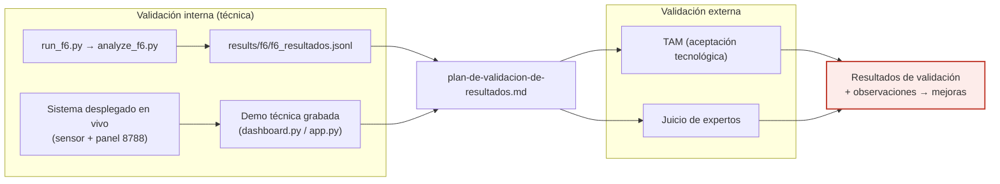

# F7 · Validación ◆ (aporte)

**Objetivo.** Cerrar la metodología con **validación interna** (demo técnica
grabada del sistema funcionando, respaldada por las corridas operacionales F6) y
**validación externa** (**TAM** + **juicio de expertos**). Casi ningún artículo
del estado del arte valida en operación real ni con usuarios/expertos.

## Diagrama

## Flujo

La **validación interna** es **técnica**: se demuestra el sistema funcionando en
vivo (panel + enforcement) y se respalda con las **corridas operacionales F6**
(`run_f6.py` / `analyze_f6.py`): dos pases de 29 corridas con el motor activo,
*lead time* mediano de detección+bloqueo y **cero caídas en 58 corridas**. Se
conservan incluso los pases descartados (`f6_resultados.pass1-contaminado.jsonl`),
y se **declaran las limitaciones medidas** (p. ej. el FPR benigno sube en
operación respecto al laboratorio) — la honestidad metodológica es parte del
aporte.

La **validación externa** usa **TAM** (modelo de aceptación tecnológica) y
**juicio de expertos**, con el **guion de observación** y el **plan de
validación** como instrumentos. El panel de solo lectura sirve de soporte a la
demo. (El instrumento SUS existe como artefacto, pero el plan vigente centra la
externa en TAM + expertos.)

## Entradas y salidas

- **Entradas:** sistema desplegado en vivo (F6), corridas F6, validadores
  (expertos / usuarios).
- **Salidas:** `f6_resultados.jsonl`, resultados TAM / juicio de expertos, plan de
  validación, grabación de la demo, observaciones para mejoras.

## Archivos que se tocan / se usan

| Archivo | Tipo | Rol |
|---|---|---|
| `scripts/f6/run_f6.py`, `analyze_f6.py` | `.py` | Corridas operacionales y su análisis |
| `results/f6/f6_resultados.jsonl` (+ `pass1-contaminado.jsonl`) | `.jsonl` | Resultados de las corridas (se conserva lo descartado) |
| `scripts/engine/dashboard.py`, `dashboard/app.py` | `.py` | Panel de solo lectura para la demo técnica |
| `scripts/entregables/calcular_sus.py` | `.py` | Cálculo SUS (instrumento disponible) |
| `scripts/entregables/generar_plan_validacion_word.py` | `.py` | Genera el plan de validación |
| `03-entregables/07-plan-de-validacion/plan-de-validacion-de-resultados.md` | `.md` | Plan de validación (interna + externa) |
| `03-entregables/08-validacion-usuarios/{guion-observacion,instrumento-SUS,README}.md` | `.md` | Instrumentos de la validación externa |
| `configs/cyberflow.toml` → `[panel]` | `.toml` | Panel para la demo (origenes permitidos) |

➡ Anterior: [F6](F6-despliegue-y-operacion.md) · Volver al [índice](README.md)
