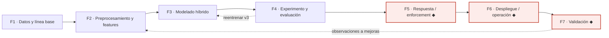

# Metodología de CyberFlow — 7 fases

Documentación de la metodología del sistema, estructurada en **7 fases**. Cada
fase tiene su propio documento con: un **diagrama Mermaid** del procedimiento, la
explicación del **flujo** (componentes, herramientas, entradas y salidas) y la
tabla de **archivos que se tocan / se usan y su tipo**.

> Esta estructura de 7 fases se derivó del análisis de los 15 artículos semilla
> (`Arituclos 15/METODOLOGIA/FASES-METODOLOGIA-15-ARTICULOS.xlsx`). La mayoría de
> esos trabajos **se detiene en la evaluación (F4)**; CyberFlow es el único que
> continúa hasta **Respuesta (F5)**, **Despliegue/Operación (F6)** y **Validación
> (F7)** — las tres fases marcadas con ◆, que son el **aporte diferenciador**.

## Las 7 fases

| # | Fase | Qué resuelve | Documento |
|---|---|---|---|
| F1 | **Datos y línea base** | Captura pasiva por espejo SPAN y línea base recalibrada en red real | [F1](F1-datos-y-linea-base.md) |
| F2 | **Preprocesamiento y features** | Del tráfico a 28 features multicapa L3/L4/L7 (esquema congelado) | [F2](F2-preprocesamiento-y-features.md) |
| F3 | **Modelado híbrido** | 7 modelos → IsolationForest recalibrado + heurísticos | [F3](F3-modelado-hibrido.md) |
| F4 | **Experimento y evaluación** | Replay del mismo PCAP a CyberFlow y Suricata; métricas | [F4](F4-experimento-y-evaluacion.md) |
| F5 ◆ | **Respuesta / enforcement** | Decisión → feed firmado → acción nftables (PERMIT/LIMIT/BLOCK) | [F5](F5-respuesta-enforcement.md) |
| F6 ◆ | **Despliegue / operación** | Desplegado en el sensor, enforcement en vivo, replicable | [F6](F6-despliegue-y-operacion.md) |
| F7 ◆ | **Validación** | Interna (demo técnica) + externa (TAM + juicio de expertos) | [F7](F7-validacion.md) |

## Flujo general

## Contribución (valor agregado)

Qué distingue a este trabajo de los 15 artículos semilla:

- **Detecta ataques SIN firma:** **9/9** vs **0/9** de Suricata (ET Open).
  Complementa a Suricata (firmas), no compite.
- **Dataset propio de red real** (segmentada, conmutador físico, espejo SPAN), no
  datasets públicos → cierra el salto simulación→realidad.
- **Recalibración en la propia red** (FPR 92,4 % → 4,45 %): medición, no demo.
- **Responde, no solo detecta** ◆: PERMIT/LIMIT/BLOCK con feed firmado (Ed25519) y
  enforcement en los hosts.
- **Desplegado y operando en vivo** ◆: en el sensor, replicable, 58 corridas sin
  caídas.
- **Detector híbrido (modelo + heurísticos):** 9/9 (modelo solo 6/9, heurísticos
  7/9), sin datos sintéticos (sin SMOTE).
- **Validación real** ◆: interna (demo técnica) + externa (TAM + juicio de expertos).

**Dónde NO destaca (honesto):** en **velocidad** cuando el ataque tiene firma
(Nikto: Suricata 3,4 s vs 12 s), y el FPR **sube en operación** (~23–26 %).

## Dónde viven los artefactos reales

Los archivos citados en cada fase viven en dos repositorios:

- **`producto-as-deployed/`** — el producto tal como se desplegó: `scripts/`,
  `configs/`, `artifacts/`, `dashboard/`, `ansible/`, `docs/`.
- **`orquestacion-limpio/`** (este repo) — orquestación, método de comparación
  vs Suricata (`02-metodologia/comparacion-cyberflow-suricata/`), evidencias
  (`04-evidencias/`) y entregables (`03-entregables/`).

## Leyenda de tipos de archivo

| Tipo | Significado |
|---|---|
| `.py` | script de Python (extractor, modelado, motor, scorer, entregables) |
| `.sh` | script de shell (orquestación de campañas, captura, Suricata) |
| `.json` | configuración (features, campañas) o salida estructurada (`manifest`, `eve.json`, resultados) |
| `.toml` | configuración única del despliegue (`cyberflow.toml`) |
| `.service` / `.timer` / `.yml` | unidades systemd y playbooks Ansible (despliegue) |
| `.csv` | dataset (una fila por ventana) |
| `.pcap` | captura de red cruda (anillo; no entra en Git) |
| `.joblib` / `.pkl` | modelo serializado congelado |
| `.jsonl` | resultados línea-por-registro (validación, scores) |
| `.log` | registro de decisiones del motor |
| `.md` | documentación y evidencia verificable |

## Metodología vs. Resultados (dónde va la GUI y las alertas)

Regla simple: **la metodología dice _cómo funciona_; los resultados dicen _qué pasó_.**

| Concepto | ¿Metodología o Resultados? |
|---|---|
| **El panel / GUI como componente** (de solo lectura, qué muestra: salud, actividad, bloqueos, decisiones, *scores*) | **Metodología** — es parte del sistema desplegado (F6) y del método de validación (F7). Se describe **brevemente**: para qué sirve y qué expone. |
| **El mecanismo de alertas** (a Wazuh + registro + panel; hacia dentro de la red) | **Metodología** — F5 (respuesta). Se describe el mecanismo. |
| **Capturas del panel con detecciones/bloqueos reales**, alertas que saltaron, la demo en vivo | **Resultados** — son evidencia de operación (figuras/tablas de resultados). |
| **Cifras** (9/9 vs 0/9, FPR, latencias, lead time) | **Resultados**. |

Es decir: **la GUI no es una fase aparte.** Como herramienta vive en F6/F7; lo que la
GUI *mostró* durante la evaluación (capturas, alertas, bloqueos) va en **Resultados**.
