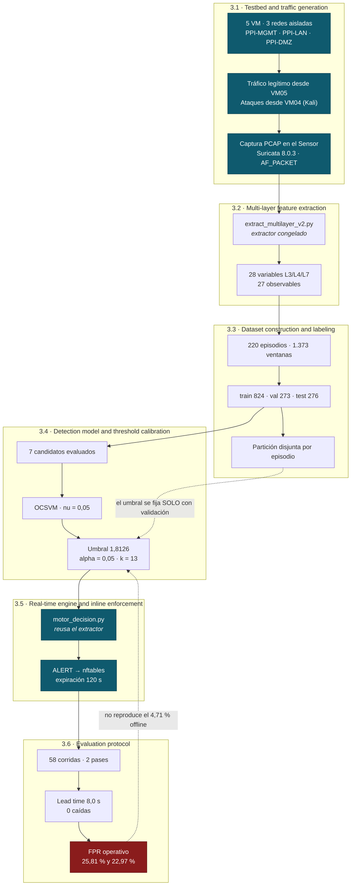
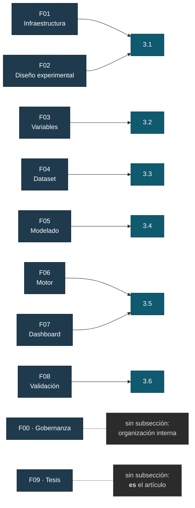

# Diagrama de la metodología

**`DOC-016`** · Las seis subsecciones de «Proposed methodology» del artículo.

Se dibuja en Mermaid dentro de un `.md` a propósito: **GitHub lo renderiza
nativamente**, así que el diagrama se lee en el navegador sin exportar ninguna
imagen, y se corrige editando texto en vez de rehaciendo un PNG.

---

## El flujo

**En azul**, lo que ningún artículo comparable de IJIES tiene: laboratorio
propio, generación de tráfico y motor con bloqueo real.
**En rojo**, la limitación medida que no se oculta.

Las dos flechas punteadas son las que un revisor va a mirar: el umbral se fija
**solo con validación**, nunca con prueba; y el FPR operativo **no reproduce**
el de laboratorio.

---

## De dónde sale cada bloque

**Diez fases de trabajo, seis subsecciones de artículo.** No se pierde nada:
`F00` es organización interna y `F09` **es** el artículo.

---

## Por qué 3.2 va antes que 3.3

En los cinco artículos de IJIES analizados el dataset va **antes** que las
variables, porque sus autores descargan NSL-KDD o UNSW-NB15 y luego seleccionan
características sobre él.

Aquí no. El extractor convierte los paquetes en vectores, y **esos vectores son
las filas del dataset** — 43 columnas: `episode_id`, `partition`, `label` y las
28 variables. No hay dataset antes de extraer.

Justificación completa y los cinco DOI:
`docs/articulo/02-estructura-metodologia.md` en el producto.
